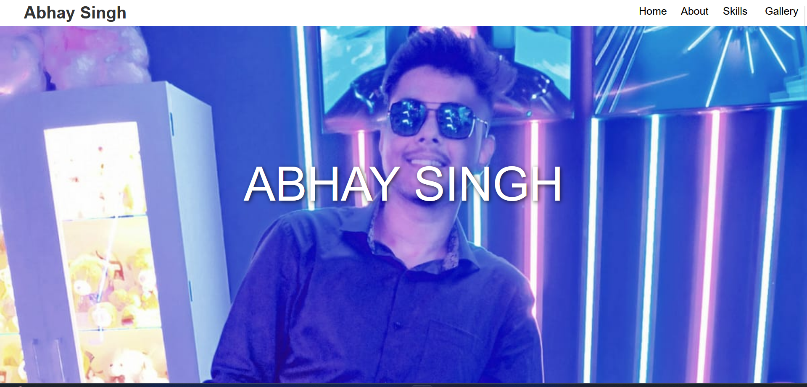
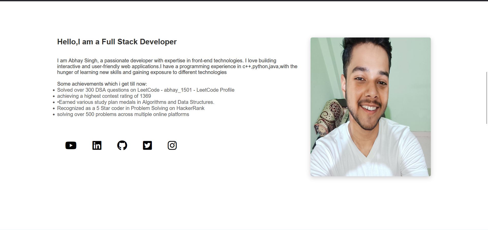
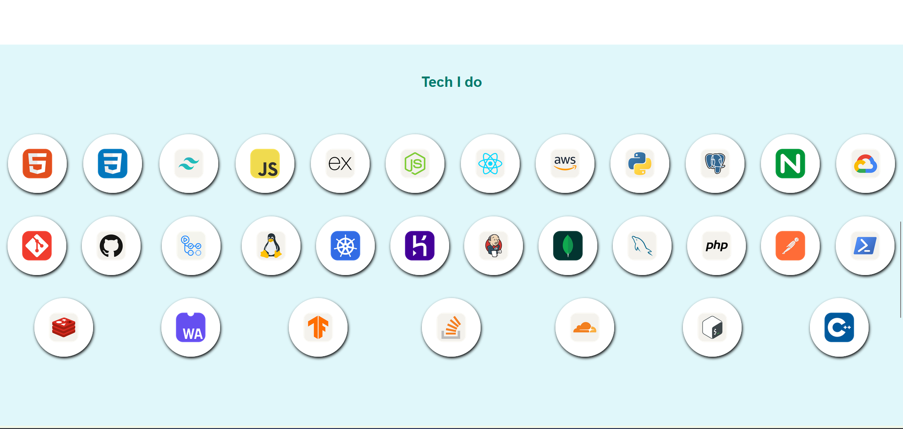

# Abhay Singh - Developer Portfolio

Welcome to my personal developer portfolio! This project is built to showcase my journey as a Full Stack Developer. It highlights my skills, achievements, and some of the technologies I have worked with.

## Table of Contents
- [Features](#features)
- [Technologies Used](#technologies-used)
- [Screenshots](#screenshots)
- [Installation](#installation)
- [Contributing](#contributing)
- [Contact](#contact)

---

## Features
- **Responsive Design**: The portfolio is fully responsive and works on all device sizes.
- **Interactive UI**: Contains interactive elements such as hover effects, grayscale background transitions, and animations.
- **Skills Showcase**: Displays a variety of technologies I have experience with, using images and tooltips.
- **Gallery Section**: A photo gallery showcasing my work or personal pictures with hover effects.
- **Social Links**: Easy access to my social profiles like LinkedIn, GitHub, and more.

---

## Technologies Used
- **HTML5**
- **CSS3**
- **JavaScript**
- **FontAwesome for icons**
- **Bootstrap** (Optional: If added for responsiveness)
- Various technology logos for skills

---

## Screenshots

### Home Section


### About Section


### Skills Section


---

## Installation
1. Clone the repository:
   ```bash
   git clone https://github.com/abhay-singh/portfolio.git

2. Navigate to the project directory:
   cd portfolio

3. Open index.html in your browser to view the portfolio.

## Contributing
Feel free to contribute to this project by creating issues or submitting pull requests. Any suggestions to enhance the portfolio are welcome.

## Contact
If you'd like to get in touch, feel free to reach out on:

LinkedIn: https://www.linkedin.com/in/abhaysingh0224/
GitHub: https://github.com/Abhay1516/